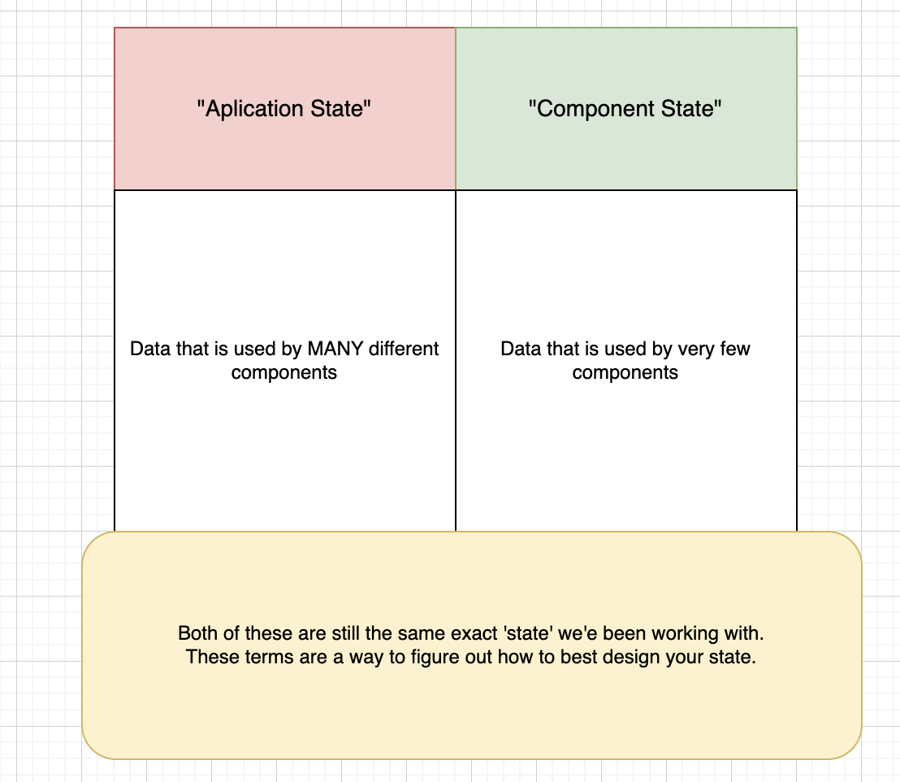

## Command to run PROJECT
- npm start
- npm run server

Example used for lesson 127: More on useEffect 
https://codepen.io/sgrider/pen/BarEowz?editors=1111



## Notes from Section 6: How to handle forms

https://github.com/JessicaRodriguesFelix/udemy-modern-react-with-redux/assets/40796998/b51e67b3-7d7c-4254-84e6-38925d848fb7


State location:
- Rerender the component it is defined in + all that components children
- Find all the components that need to use this state
- Define the state in the lowest common parent

- EVENT HANDLER
Plain functions that modified our piece of state in some way.

- DO NOT DIRECTLY MUTATE/CHANGE/MODIFY arrays or objects, when they are used/managed by the state system.
- **REMINDER**: React treats numbers, string, booleans, undefined and null DIFFERENTLY than objects and arrays.
- State Updates - Cheat Sheet (https://state-updates.vercel.app/)

  - Adding elements to the start or end
```
// add to start
const [colors, setColors] = useState([]);

const addColor = (newColor) => {
  const updatedColors = [ newColor, ...colors ];
  setColors(updatedColors);
}

```

Variations using filter function (FKT - Filter keeps true)

- First variation remove element with a particular value
```
  const [colors, setColors] = useState(['red','green', 'blue]);

  const removeColor = (colorToRemove) => {
    const updatedColor = colors.filter((color)=>
       color !== colorToRemove)
  }
  setColors(updatedColor)
```
- Second variation: Remove element at an specific element

```
  const [colors, setColors] = useState([]);
  const removeColorAtIndex = (indexToRemove) => {
    const updatedColors = colors.filter((color, index) => {
      return indexToRemove !== index;
    })
  }
  setColors(updatedColors);
```

- Third variation: Remove element with a particular property

const [books, setBooks] = useState([
  {id: 1, title: 'harry'},
  {id: 2, title: 'dark'}
]);

const removeBookById = (id) => {
 const updatedBooks = books.filter((book) => {
    return book.id !== id;
  })
  setBooks(updatedBooks)
}

- Modify an element based on property
```
const [books, setBooks] = useState([
  {id: 1, title: 'harry'},
  {id: 2, title: 'dark'}
]);

const updateBookId = (id, newTitle) => {
  const update = books.map((book) => {
    if (book.id == id) {
      return {...book, title: newTitle};
    }
    return book;
  });
  setBooks(updateBookId);
}
```

- Add elemtn to the middle of an array using .slice function

```
const [colors, setColors] = useState([]);

const addColorAtIndex = (newColor, index) => {
   const updatedColors = [
//gives back everything that was included in the array colors from index 0 up to index you want to insert new element
   ...colors.slice(0, index),
    newColor,
   ... colors.slice(index)
]
}
```
- Add or change properties to an object
```
const [fruit, setFruit] = useState({
  color: 'red',
  name: 'apple'
})

const changeColor = (color) => {
   const updatedFruit = {
    // this line copies all properties from existing object
      ...fruit, 
      color: color;
    };
    setFruit(updatedFruit);
}
```

Removing properties from an object

const [fruit, setFruit] = useState({
  color:'red',
  name: 'apple
})

const removeColor = () => {
  const {color, ...rest } = fruit;
  setFruit(rest)
}

Standalone API Client
- Program used to make requests to an API server, specifically for development/test
- There are many free API Clients
- To make a network request we will use a third party liobrary called Axios.

useEffect
- Function that we import from React;
- Used to run code when a component is initially rendered and (somethimes) when it is rerendered.

For example:
- First argument is a function that contains code we want to run.
- Second is an array or nothing - this controls whether the functions is executed on rerenders.
useEffect(() => {
  console.log('Hi)
}, [])

Tricky things around useEffect()
1) Understanding when our arrow function gets called;
2) Understanding the arrow function's return value;
3) Understanding stale variables references;

**Function passed to useEffect() is ALWAYS called in the FIRST render;**
**Function passed to useEffecr maybe called in the second, third and so on renders, it depends on the 2 argument we pass to useEffect.**


##############################################
### Section 8 - Communication Using the Context System
- Share information accross different components.
- Context system we can share data accross components.
- Context is *not a replacement* for Props.
- Context is *not a replacement* for Redux.

USING CONTEXT
1) Create the context.
2) Specify the data that will be shared.
  - 'value' prop is super special.This is what will be shared with rest of app.
3) 'Consume' the data in a component.
  - Import the context object
  - 'num' is the value stored in context - 5!
  - Function for accessing value in contextx``


Lessons to re-watch:
- 131 - Introducing context

## Section 9: Deeper Dive into Hooks!
- Understanding when our arrow function gets called.
- Understanding the arrow functions's return value.
  - 

- Understadning stale variables references
  - Possible bug anytime your useEffect contains a function that refers to a variable.
  - Extremely common bug.
  - Create-React-App includes an ESLint rule to help you find this.
  - Following the ESLint rule can lead to more bugs**
  - useCallback hook to help you tell React that your function is notactually changing over time.
  - Fixes bugs around useEffect and other similar situations.
  - Follows similar conventions as useEffect (second argument is an array).
      - useCallback behaves very different after first render
        - If second argument is an empty array, useCallback gives you back the original fetchBooks from first render;
        - If second argument has elements that have changed since last render, useCallback gives you the new version of fetchBooks;

